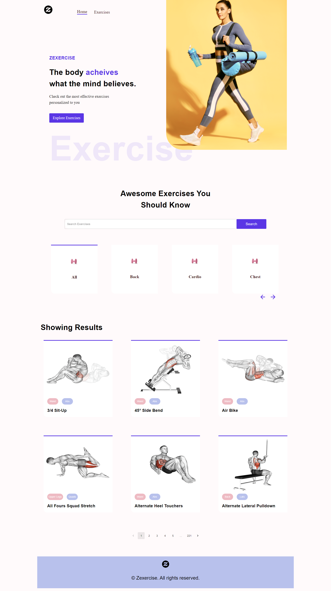
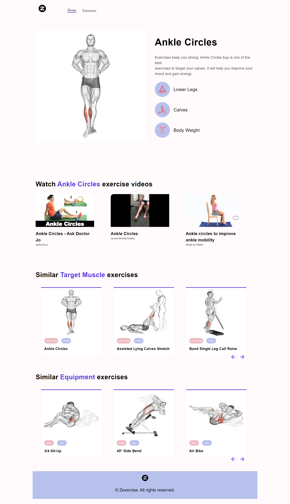

 <h1>Zexercise</h1>
  
  <p>
    Zexercise is a modern <b>Fitness Exercises App</b> with beautiful UI using the Material UI
  </p>

<!-- About the Project -->
## :star2: About the Project

<div align="center"> 
  
  
</div>

<br />

Zexercise is a Fitness Exercises App with the functionality to choose exercise categories and specific muscle groups,
browse 1,300 exercises with practical examples, pagination, exercise detail, pull related videos from youtube, display similar exercises,
and much more - based on [YouTube Search and Download](https://rapidapi.com/h0p3rwe/api/youtube-search-and-download) & [Exercise DB](https://rapidapi.com/justin-WFnsXH_t6/api/exercisedb) APIs powered by [RapidAPI](https://rapidapi.com).

<!-- Folder Structure -->
### :bangbang: Folder Structure

Here is the folder structure of Zexercise.
```
Zexercise-Fitness-App/
|- public/
|- src/
  |-- assets/
  |-- components/
  |-- pages/
  |-- utils/
```

Now, lets dive into the public and src folders.

### public

`index.html` - `manifest.json`

The public folder contains the HTML file so you can tweak it, for example, to set the page title. The <script> tag with the compiled code will be added to it automatically during the build process.

### src

#### components

`BodyPart.js` - `Detail.js` - `ExerciseCard.js` - `ExerciseVideos.js` - `Exercises.js` - `Footer.js` - `HeroBanner.js` - `HorziontalScrollbar.js` - `Loader.js` - `Navbar.js` - `SearchExercises.js` - `SimilarExercises.js`

JS files contain **Zexercise** components which split the UI into independent and reusable pieces.

`BodyPart.js` - This component displays exercise category used for muscle groups search.

`Detail.js` - This component displays exercise detail used for any exercise page.

`ExerciseCard.js` - This component displays exercise card with the body part, target muscle and name that links to related exercise page.

`ExerciseVideos.js` - This component displays a box of exercise video with the video title, channel name, and thmubnail.

`Exercises.js` - This component displays the list of exercises by fetching data according to user-input using ExerciseCard widget.

`Footer.jsx` , `Navbar.jsx` - This components displays the Navigation Bar & Footer.

`HeroBanner.js` - This component displays a beautiful HeroBanner with quotes.

`HorizontalScrollbar.js` - This component handle the Horizontal Scrollbar widget logic used for many components, built with `react-horizontal-scrolling-menu` dependency.

`SearchExercises.js` - This component display the search box and handle search logic.

`SimilarExercises.js` - This component display a similar exercises by target muscle used for any exercise page.

`Loader.js` - InfinitySpan loadig component for display while waiting to fetch the result from the APIs using `react-loader-spinner` package.

`Results.jsx` - Results component handles the display form of the fetched results, that is, widgets for the various links.

`Router.jsx` - Router component enables the navigation among views of various components in application.

`Search.jsx` - Search components (includes search field, search button and classification links).

#### pages

`ExerciseDetail.js` - Implementation of dynamic Exercise Detail page which explore exercise detail, videos and similar exercises.

`Home.js` - Implementation of Home page, where the user can search for exercises according to data types (name, target muscle, equipment or body part) and explore a preview of the exercises found.

#### utils

`fetchData.js` - Fetching data from sources using RapidAPI using environment variables for API keys.

<br />

<!-- ENV VARIABLES -->
### :key: Environment Variables

In order to use Zexercise you have to create your [YouTube Search and Download](https://rapidapi.com/h0p3rwe/api/youtube-search-and-download) & [Exercise DB](https://rapidapi.com/justin-WFnsXH_t6/api/exercisedb) api key powered by RapidAPI [here](https://rapidapi.com), to run this web app, you will need to add the following environment variable to your .env file

`REACT_APP_RAPID_API_KEY`
`REACT_APP_RAPID_YOUT_API_KEY`

The variable can be combined when using a single API key, the fetchData file must be updated accordingly.

# Getting Started with Create React App

This project was bootstrapped with [Create React App](https://github.com/facebook/create-react-app).

## Available Scripts

In the project directory, you can run:

### `npm start`

Runs the app in the development mode.\
Open [http://localhost:3000](http://localhost:3000) to view it in your browser.

The page will reload when you make changes.\
You may also see any lint errors in the console.

### `npm test`

Launches the test runner in the interactive watch mode.\
See the section about [running tests](https://facebook.github.io/create-react-app/docs/running-tests) for more information.

### `npm run build`

Builds the app for production to the `build` folder.\
It correctly bundles React in production mode and optimizes the build for the best performance.

The build is minified and the filenames include the hashes.\
Your app is ready to be deployed!

See the section about [deployment](https://facebook.github.io/create-react-app/docs/deployment) for more information.

### `npm run eject`

**Note: this is a one-way operation. Once you `eject`, you can't go back!**

If you aren't satisfied with the build tool and configuration choices, you can `eject` at any time. This command will remove the single build dependency from your project.

Instead, it will copy all the configuration files and the transitive dependencies (webpack, Babel, ESLint, etc) right into your project so you have full control over them. All of the commands except `eject` will still work, but they will point to the copied scripts so you can tweak them. At this point you're on your own.

You don't have to ever use `eject`. The curated feature set is suitable for small and middle deployments, and you shouldn't feel obligated to use this feature. However we understand that this tool wouldn't be useful if you couldn't customize it when you are ready for it.

## Learn More

You can learn more in the [Create React App documentation](https://facebook.github.io/create-react-app/docs/getting-started).

To learn React, check out the [React documentation](https://reactjs.org/).

### Code Splitting

This section has moved here: [https://facebook.github.io/create-react-app/docs/code-splitting](https://facebook.github.io/create-react-app/docs/code-splitting)

### Analyzing the Bundle Size

This section has moved here: [https://facebook.github.io/create-react-app/docs/analyzing-the-bundle-size](https://facebook.github.io/create-react-app/docs/analyzing-the-bundle-size)

### Making a Progressive Web App

This section has moved here: [https://facebook.github.io/create-react-app/docs/making-a-progressive-web-app](https://facebook.github.io/create-react-app/docs/making-a-progressive-web-app)

### Advanced Configuration

This section has moved here: [https://facebook.github.io/create-react-app/docs/advanced-configuration](https://facebook.github.io/create-react-app/docs/advanced-configuration)

### Deployment

This section has moved here: [https://facebook.github.io/create-react-app/docs/deployment](https://facebook.github.io/create-react-app/docs/deployment)

### `npm run build` fails to minify

This section has moved here: [https://facebook.github.io/create-react-app/docs/troubleshooting#npm-run-build-fails-to-minify](https://facebook.github.io/create-react-app/docs/troubleshooting#npm-run-build-fails-to-minify)
